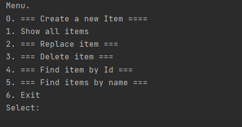
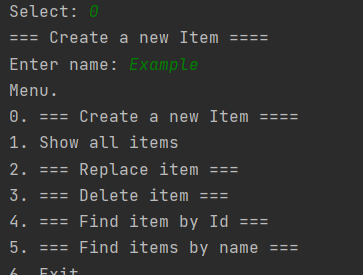
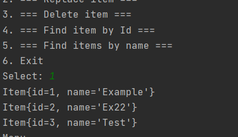

# job4j_tracker
# О проекте 
Предназначен для закрепления знаний, полученных при изучении блока посвященного ООП из курса [по основам языка Java.](https://github.com/KirillReal/job4j_elementary)

Этот проект - консольное приложение. После запуска пользователю отображается меню с возможностями программы. Программа просит ввести в консоль пункт меню для дальнейшего действия. Например, пользователь ввел цифру 0. Система просит пользователя ввести имя заявки. После этого действия система сохраняет в памяти заявку и снова отображает пункты меню. Если пользователь выбрал пункт 6 - это будет выход из программы, т.е. программа закрывается.

# Структура проекта
* Данные будут храниться в памяти. Хранилище будет описывать класс [ru.job4j.tracker.MemTracker](https://github.com/KirillReal/job4j_tracker/blob/master/src/main/java/ru/job4j/tracker/MemTracker.java)
* Так же описано хранилище основанное на базе данных [ru.job4j.tracker.SqlTracker](https://github.com/KirillReal/job4j_tracker/blob/master/src/main/java/ru/job4j/tracker/SqlTracker.java)
* [ru.job4j.tracker.Item](https://github.com/KirillReal/job4j_tracker/blob/master/src/main/java/ru/job4j/tracker/Item.java) объект этого класса будет описывать модель данных
* Объект для управления меню [ru.job4j.tracker.StartUI](https://github.com/KirillReal/job4j_tracker/blob/master/src/main/java/ru/job4j/tracker/StartUI.java)

# Изменения в проекте
* [Удалили зависимость StartUI](https://github.com/KirillReal/job4j_tracker/commit/9ba58599895205d98202ee98dfd2fffa4884de93) от внешних ресурсов (Scanner)
* [Удалили зависимость](https://github.com/KirillReal/job4j_tracker/commit/1178bbeded171182e1e18532ffcd666eb47778b1) классов от внешних ресурсов (System.out)
* Реализовали StartUI за счет шаблона стратегия. Этот шаблон позволяет изменить алгоритм работы программы в запущенной программе
* Шаблон декоратор для валидатора. Смысл Декоратора - добавление нового поведения в уже существующее поведение
* Шаблон фабричный метод. Смысл этого шаблона в создании метода, который создает новый экземпляр объекта. Шаблон абстрактная фабрика. Главное отличие от фабричного метода, абстратная фабрика это интерфейс, который содержит абстратные методы для создания экземплятов.

# Singleton
[Шаблон singleton](https://github.com/KirillReal/job4j_tracker/blob/master/src/main/java/ru/job4j/tracker/TrackerSingle.java) - используется для создания класса, который может содержать только один экземпляр объекта в виртуальной машине. Шаблон singleton применять в проектах, где используются работы с внешними ресурсами: базы данных, серверы. Шаблон может быть с ленивой и энергичной загрукой.
* [Ленивая загрузка (Lazy loading)](https://github.com/KirillReal/job4j_tracker/blob/master/src/main/java/ru/job4j/tracker/TrackerSingleLazyLoad.java) происходит, когда мы явно обращаемся к объекту. Происходит его загрузка.
* [Энергичная загрузка (Eager loading)](https://github.com/KirillReal/job4j_tracker/blob/master/src/main/java/ru/job4j/tracker/TrackerEagerLoad.java) - загружает объект сразу после старта виртуальной машины.
